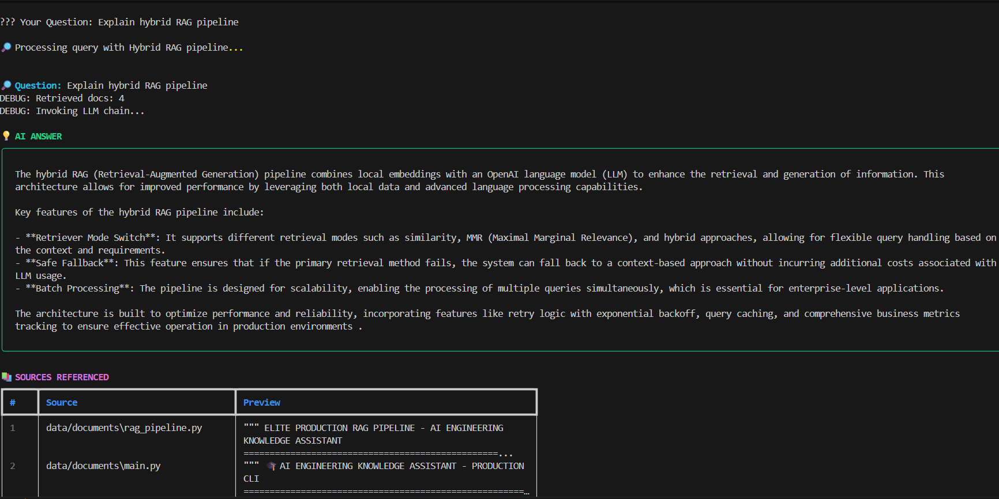
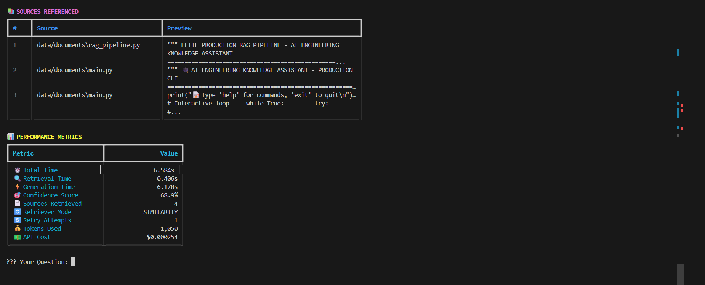
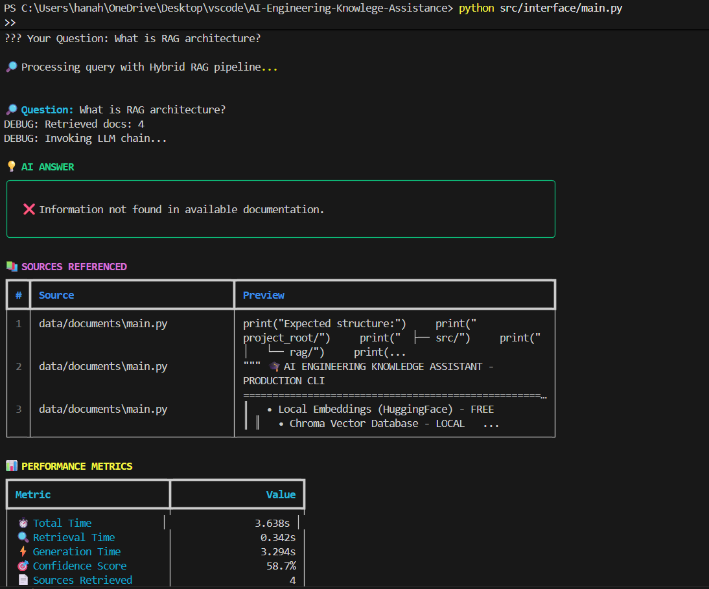
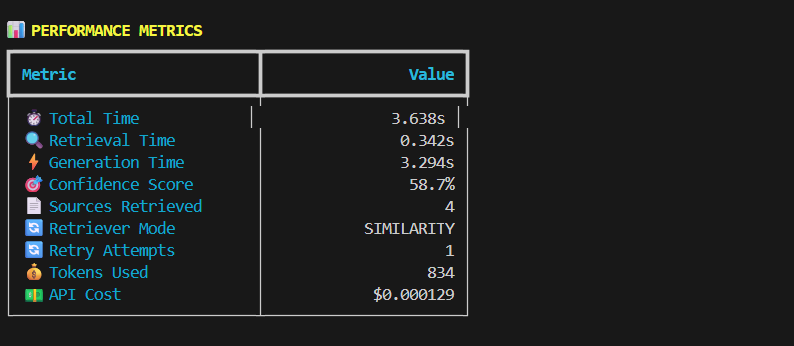

# 🎓 AI Engineering Knowledge Assistant

# AI Engineering Knowledge Assistant (Hybrid RAG)

An LLM-powered internal AI assistant built using LangChain, OpenAI GPT-4o-mini, and ChromaDB to answer technical questions from documentation using Retrieval-Augmented Generation (RAG).

This project simulates a real-world enterprise AI tool used for:
- AI assistants and chatbots
- Knowledge base automation
- Engineering documentation Q&A
- LLM-driven internal tools for business and technical teams
  
---

## Overview

The AI Engineering Knowledge Assistant is a CLI-based Hybrid RAG pipeline that retrieves relevant documents from a local vector database (ChromaDB) and generates context-grounded answers using an LLM (GPT-4o-mini).

Unlike basic chatbots, this system:
- Uses real project files as a knowledge base  
- Prevents hallucination with strict context grounding  
- Tracks cost, performance, and confidence metrics  
- Implements production features such as retry logic, caching, and fallback  

---

## Key Features

### 🔍 Retrieval System
- Similarity Search (semantic retrieval)
- MMR Retrieval (diverse document selection)
- Dynamic Retriever Switching
- Source File Filtering (enterprise-style control)

### 🤖 Production AI Capabilities
- Hybrid RAG Architecture (Local Embeddings + LLM)
- Modern LCEL Runnable Chain (LangChain 2024+)
- Retry Logic with Exponential Backoff
- Safe Fallback (zero extra LLM cost)
- Query Caching System
- Confidence Scoring
- Cost Tracking per Query

### 📊 Observability & Analytics
- Response time tracking
- Token usage monitoring
- API cost tracking
- ROI analytics
- Export to JSON/CSV for analysis

---

## 🏗️ System Architecture (Production Hybrid RAG)


User Query (CLI - main.py)  
        ↓  
EnhancedProductionRAG (Core Engine)  
        ↓  
Query Processing Layer  
 ├── Cache Check (Deterministic Caching)  
 ├── Retry Logic (Exponential Backoff)  
 └── Metrics Initialization  
        ↓  
Dynamic Retrieval Layer  
 ├── Similarity Retriever (Fast Semantic Search)  
 └── MMR Retriever (Diverse Document Retrieval)  
        ↓  
Chroma Vector Database (Local)  
        ↓  
HuggingFace Embeddings (Sentence Transformers)  
        ↓  
LCEL Runnable Chain (LangChain 2024+)  
 ├── Context Formatting  
 ├── Prompt Template (Anti-Hallucination)  
 └── GPT-4o-mini (LLM Generation)  
        ↓  
Post-Processing Layer  
 ├── Confidence Scoring  
 ├── Cost Tracking (OpenAI Callback)  
 ├── Source Attribution  
 └── Safe Fallback (Context-Based Response)  
        ↓  
Final Output  
Answer + Sources + Metrics + Cost + Confidence

---

## 🚀 Demo (CLI - Hybrid RAG in Action)






---

## 🔄 End-to-End RAG Pipeline Flow

1. User asks a technical question via CLI  
2. System checks cache for repeated queries  
3. Dynamic retriever fetches top-k relevant documents  
4. Documents are filtered and formatted as context  
5. LCEL chain constructs prompt with strict grounding rules  
6. GPT-4o-mini generates a context-aware answer  
7. System calculates confidence, cost, and performance metrics  
8. Final response is returned with sources and analytics

---

## Project Structure

```
AI-Engineering-Knowledge-Assistant/
│
├── .github/
│ └── workflows/
│ └── ci.yml # GitHub Actions CI/CD pipeline
│
├── assets/ # Demo screenshots (README images)
│ ├── demo_1.png
│ ├── demo_1.5.png
│ ├── demo_2.png
│ └── demo_2.2.png
│
├── data/
│ ├── documents/ # Knowledge base files (PDF, MD, TXT, code)
│ ├── vector_store/ # Chroma vector DB (auto-generated)
│ └── query_cache.pkl # Cached query results (auto-created)
│
├── exports/ # Exported analytics (JSON/CSV)
│
├── src/
│ ├── ingestion/
│ │ ├── init.py
│ │ └── knowledge_base.py # Document loading + embeddings + vector DB
│ │
│ ├── rag/
│ │ ├── init.py
│ │ └── rag_pipeline.py # Core EnhancedProductionRAG (main engine)
│ │
│ └── interface/
│ ├── init.py
│ └── main.py # CLI entry point (interactive assistant)
│
├── .env # Environment variables (NOT pushed to GitHub)
├── .gitignore # Ignore secrets, cache, vector DB
├── requirements.txt # Project dependencies
├── README.md # Project documentation
└── LICENSE # (Optional but recommended)
```
---

## Tech Stack

| Category        | Technology |
|-----------------|------------|
| Language        | Python 3.10+ |
| LLM             | OpenAI GPT-4o-mini |
| Framework       | LangChain (LCEL Architecture) |
| Vector Database | ChromaDB (Local) |
| Embeddings      | HuggingFace Sentence Transformers |
| Interface       | CLI (Production Stable) |
| CI/CD           | GitHub Actions |

---

## Installation

### 1. Clone the Repository
```bash
git clone https://github.com/Hanah7511/AI-Engineering-Knowledge-Assistant.git
cd AI-Engineering-Knowledge-Assistant

### 2. Create Virtual Environment
python -m venv venv
# Windows
venv\Scripts\activate
# Mac/Linux
source venv/bin/activate  

### 3. Install Dependencies

pip install -r requirements.txt

### 4. Add Environment Variables

Create a .env file in the root directory:
OPENAI_API_KEY=your_api_key_here

---

## CI/CD Pipeline

This project includes a GitHub Actions CI pipeline that:
-Installs dependencies automatically
-Validates RAG pipeline imports
-Detects missing packages and runtime errors
-Ensures code stability on every push

Workflow location:
.github/workflows/ci.yml

---

## Production Design Highlights

- Modular architecture (ingestion, retrieval, generation separation)
- Laptop-safe optimization (low memory footprint)
- Fail-safe fallback when API fails
- Deterministic caching for repeated queries
- Enterprise-style source filtering and observability

---
## Future Improvements

-FastAPI deployment (REST API)
-Docker containerization
-Hybrid Search (BM25 + Vector)
-RAG evaluation (RAGAS)
-Web UI (optional)

---

## Author

Hana Al Haris
Final Year AI/ML Student
Portfolio Project – AI Engineering & RAG Systems
